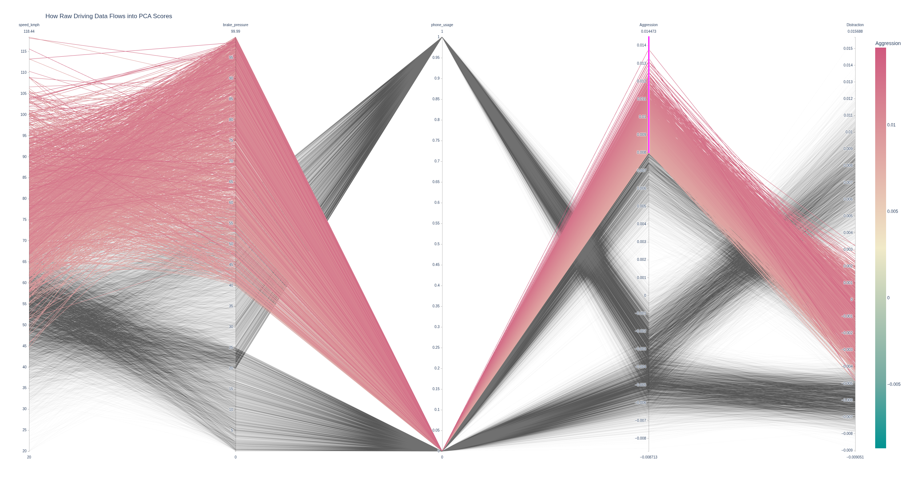
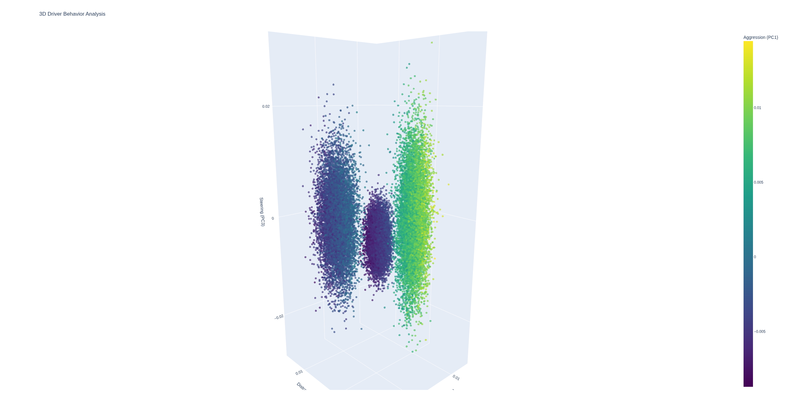

# Auto Insurance & Telematics Analytics

Welcome. This repository features two end-to-end machine learning projects focused on the automotive and insurance industries. Together, they demonstrate how to extract actionable business intelligence from both unlabelled telematics sensors and highly imbalanced insurance datasets.

The goal is to showcase end-to-end analytical thinking, robust statistical methodology, and machine learning models built to drive business value.

---

### Core Tech Stack
**Languages & Frameworks:** Python (>=3.12)
**Libraries:** `scikit-learn`, `pandas`, `numpy`, `statsmodels`, `shap`, `plotly`, `matplotlib`, `seaborn`

---

### Project Architecture Overview
Below is the interactive flowchart outlining the data engineering and modeling processes used across the projects.

*Click the image to view and interact with the full flowchart.*

---

## Project 1: Predictive Modeling for Car Insurance Claims
> **File:** [`insurance-claim.ipynb`](insurance-claim.ipynb) | **Status:** Completed | **Performance:** 0.65 cross-validated AUC, 68% recall at the tuned threshold

### Business Context
Predicting car insurance claims is notoriously difficult due to extreme class imbalance (only ~6% of policies in this dataset result in a claim). Traditional accuracy metrics are misleading in this context, masking the business cost of missed claims. This project builds a robust machine learning pipeline to identify high-risk drivers and vehicle attributes, translating complex non-linear patterns into actionable risk-management strategies.

### Key Objectives
1. **Eradicate Multicollinearity:** Automate the removal of structural multicollinearity (e.g., overlapping car physical dimensions and engine specs) using Variance Inflation Factor (VIF) calculations.
2. **Statistical Inference:** Use Stepwise Logistic Regression to distill 80+ features into the core statistical drivers of insurance risk.
3. **Predictive Machine Learning:** Run a hyperparameter-tuned "Model Bake-Off" between linear, bagging, and boosting algorithms.
4. **Business Threshold Optimization:** Recalibrate the decision threshold to maximize the capture of actual claims (recall) without overwhelming the business with false alarms.

### The Workflow
1. **Data Engineering & Feature Selection:** Cleaned string representations of torque/power, mapped binary flags, and dynamically bucketed sparse geographic categories (< 1% frequency). Dropped 56 highly correlated features using a strict VIF threshold of 5.0.
2. **Statistical Modeling:** Deployed a custom Stepwise Logistic Regression (p-value < 0.05) to isolate the statistically significant features. *Insight: older cars dramatically reduce claim risk, while premium feature packages (`is_brake_assist_Yes`) and policy tenure increase it.*
3. **Model Bake-Off:** Ran `GridSearchCV` over Logistic Regression, Random Forest, and HistGradientBoosting with `class_weight='balanced'`. **HistGradientBoosting** won with a cross-validated AUC of 0.651, narrowly ahead of Random Forest (0.648) and clearly ahead of the linear model (0.610) — evidence of non-linear risk factors.
4. **Threshold Tuning:** Used Youden's J statistic to shift the decision boundary (optimal threshold 0.496) for the imbalanced reality of the data.

### Results & Business Impact
By optimizing for recall rather than raw accuracy, the final boosted model delivers real business value:

* **High Recall (68%):** The model captures 765 of the 1,124 actual claims in the unseen test set.
* **Precision in context:** Precision sits at 9% — but the base claim rate is only 6.4%. The flagged sub-population files claims at roughly 1.5x the average rate, enough to justify targeted premium adjustments. This is an honest reflection of how hard claim prediction is; inflated numbers here would signal leakage, not skill.

---

## Project 2: Driver Behavior Profiling (Unsupervised Telematics)
> **File:** [`labeling-drivers.ipynb`](labeling-drivers.ipynb) | **Status:** Completed | **Validation:** 1.00 ARI (synthetic data)

### Business Context
In real-world Usage-Based Insurance (UBI), driver behavior data is abundant but rarely pre-labeled. This project builds a machine learning pipeline to automatically categorize drivers into distinct behavioral profiles (**Safe**, **Aggressive**, **Distracted**) using raw telematics data.

**The "Real-World" Twist:** although the original dataset contains labels (ground truth), this project intentionally treats the problem as unsupervised. It demonstrates how to use **Dimensionality Reduction (PCA)** and **Clustering (K-Means)** to discover these behaviors mathematically, from scratch.

### Key Objectives
1. **Simulate Real-World Conditions:** Train without access to the target variable (`driver_label`).
2. **Dimensionality Reduction:** Compress noisy sensor data into meaningful "behavioral dimensions."
3. **Automatic Profiling:** Group drivers based on their PCA coordinates.
4. **Validation:** Compare the unsupervised clusters against the withheld ground truth to measure how well the pipeline recovers the true labels.

### The Workflow
1. **Correlation Analysis:** Identified an "aggression box" where speed, acceleration, and braking are highly multicollinear.
2. **Dimensionality Reduction (PCA):** Reduced the dataset to **3 components** explaining **~80%** of the variance:
    * **PC1 (Aggression):** high `throttle`, `brake_pressure`, `accel_x`
    * **PC2 (Distraction):** high `phone_usage`, `reaction_time`, `lane_deviation`
    * **PC3 (Geometry):** purely `steering_angle`
3. **Unsupervised Clustering (K-Means):** Applied K-Means (k=3) to segment drivers into Safe, Distracted, and Aggressive clusters.

### Interactive Cluster Visualization
*Click the image to explore the interactive 3D scatter plot of the behavioral clusters.*

### Results & Validation
Using the withheld labels to validate the unsupervised clusters:

* **Adjusted Rand Score (ARI):** 1.00
* **Homogeneity Score:** 1.00

**A necessary caveat:** a perfect score is a hallmark of *synthetic* data — the generator produced cleanly separable behaviors, and real telematics data would never cluster this perfectly. The value demonstrated here is the pipeline itself: compressing raw sensor streams with PCA, discovering structure without labels, and validating rigorously against withheld ground truth. On this dataset, that pipeline recovers the true driver profiles exactly.
